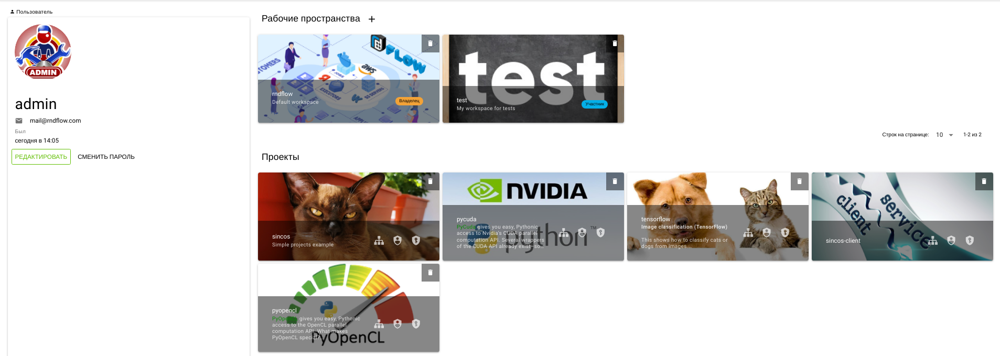
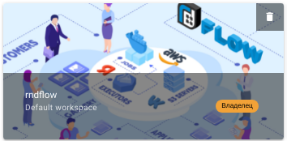
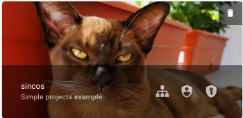

# Панель управления

## Описание

Основные компоненты платформы пользователю доступны с помощью панели управления.

Структура:

-  Пользователь - [панель пользователя](#панель-пользователя).
- [Рабочие пространства][1]

  -  Кнопка создания нового рабочего пространства
  - Список плиток доступных [рабочих пространств][1].

    > Переход в рабочее пространство осуществляется щелчком по соответсвующем плитке.

- Приглашения в рабочие пространства
  - Список плиток приглашений в рабочие пространства (только при наличии приглашения).
- Проекты

  - Список плиток доступных [проектов][2], отсортированных по времени последнего доступа.

    > Переход в проект осуществляется щелчком по соответсвующем плитке. Отображаются проекты, в список пользователей которых непосредственно включен текущий пользователь.

## Структура плитки рабочего пространства

- Изображение
-  - кнопка удаления рабочего пространства
- Название
- Описание
- Тип прав (Владелец/Участник)

## Структура плитки проекта

- Изображение
-  - кнопка добавления проекта в избранные
-  - общее количество  проекта
-  - кнопка удаления проекта
- Название
- Описание
-  Ссылка для перехода в редактор графа проекта (Граф)
-  Ссылка для перехода в редактор разрешений проекта (Разрешения)
-  Ссылка для перехода в редактор API ключей проекта (API ключи)

## Панель пользователя

### Структура

Панель пользователя отображает:

- Аватар
- Имя
-  Электронная почта
-  Веб сайт/страница пользователя
- Описание пользователя
- Время последнего подключения
- Кнопка "РЕДАКТИРОВАТЬ"
- Кнопка "СМЕНИТЬ ПАРОЛЬ"

Нажатие кнопки **РЕДАКТИРОВАТЬ** переведет панель в режим [редактирования](#редактирование).

Нажатие кнопки **СМЕНИТЬ ПАРОЛЬ** откроет панель [смены пароля](#смена-пароля).

### Редактирование

Позволяет изменить:

- Ававтар - щелкнуть по аватару
- Имя
-  Электронная почта
-  Веб сайт/страница пользователя
- Описание пользователя
- Время последнего подключения
- Кнопка "СОХРАНИТЬ"
- Кнопка "ОТМЕНА"

### Смена пароля

Необходимо ввести текущий и новый пароли.

[1]: ./workspace.md
[2]: ./project.md
