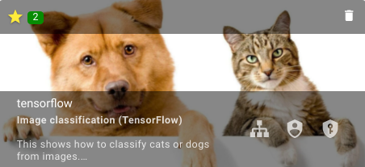

# Панель управления

## Описание

Основные компоненты платформы пользователю доступны с помощью панели управления.

Структура:

-  Панель пользователя (Пользователь)
- Список плиток доступных рабочих пространств (Рабочие пространства)
- Список плиток приглашений в рабочие пространства (Приглашения в рабочие пространства)(только при наличии приглашения)
- Список плиток доступных проектов (Проекты)

Общий вид панели управления:

Доступные действия:

- Выбор [рабочее пространство](workspace) и переход в него
- Выбор [проекта](project) и переход в него
- [Редактирование информации](#редактирование) пользователя
- [Смена пароля](#смена-пароля) пользователя

## Структура плитки рабочего пространства

- Изображение
-  Удаление рабочего пространства
- Название
- Описание
- Тип прав (Владелец/Участник)

## Структура плитки проекта

- Изображение
-  Удаление проекта
- Название
- Описание
-  Ссылка для перехода в редактор графа проекта (Граф)
-  Ссылка для перехода в редактор разрешений проекта (Разрешения)
-  Ссылка для перехода в редактор API ключей проекта (API ключи)

## Панель пользователя

### Структура

Панель пользователя отображает:

- Аватар
- Имя
-  Электронная почта
-  Веб сайт/страница пользователя
- Описание пользователя
- Время последнего подключения
- Кнопка "РЕДАКТИРОВАТЬ"
- Кнопка "СМЕНИТЬ ПАРОЛЬ"

Нажатие кнопки **РЕДАКТИРОВАТЬ** переведет панель в режим [редактирования](#редактирование).

Нажатие кнопки **СМЕНИТЬ ПАРОЛЬ** откроет панель [смены пароля](#смена-пароля).

### Редактирование

Позволяет изменить:

- Ававтар - щелкнуть по аватару
- Имя
-  Электронная почта
-  Веб сайт/страница пользователя
- Описание пользователя
- Время последнего подключения
- Кнопка "СОХРАНИТЬ"
- Кнопка "ОТМЕНА"

### Смена пароля

Необходимо ввести текущий и новый пароли.

