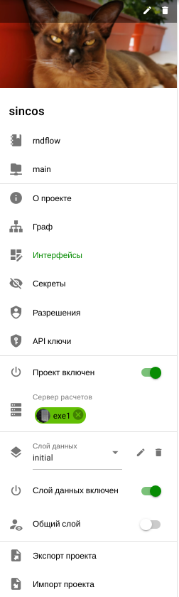
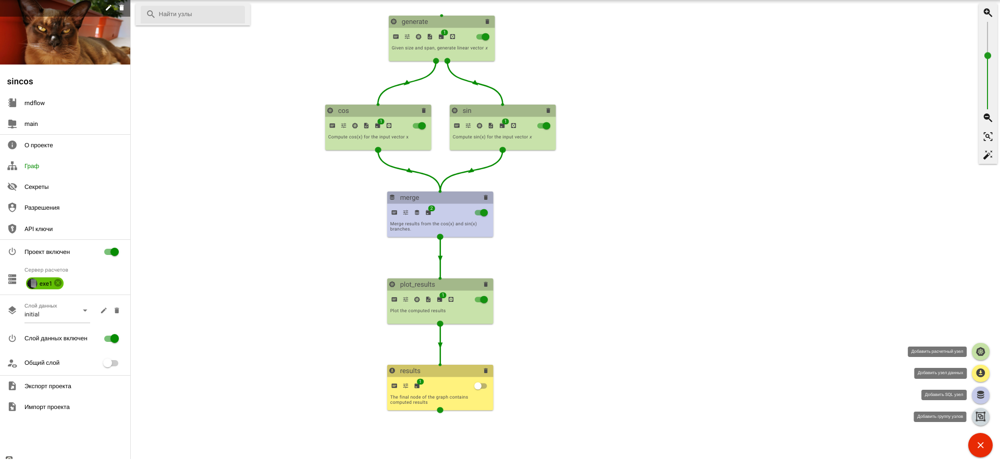
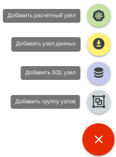

# Проект

## Описание

**Проект** - это конкретная реализация интеллектуального приложения или алгоритма средствами платформы.

**Проект-сервис** - проект с разрешенным доступом через открытое API.

Состав проекта:

- [Граф](#граф) - реализующий конкретный алгоритм в составе
  - [Узлы](./nodes.md) и [группы](./nodes.md#группа)
  - [Пакеты](./nodes.md#пакеты)
  - [Задания](./nodes.md#задания)
- [Секреты](./secrets.md) - набор секретов для использовании в узлах при их исполнении
- [Интерфейсы](./interface.md) - графические интерфейсы управления графом
- [Разрешения](#разрешения) - набор прав доступа
- [API-ключи](./api_keys.md) - набор API для внешнего доступа к проекту
- [Слои данных](/docs/intro/definitions.md#datalayer)
- [S3 сервер](./s3.md) - подключенное к проекту S3 хранилище
- [Cервер расчетов](./executor.md) - подключенный к проекту основной сервер расчетов

## Панель управления проектом

Основные свойства проекта доступны через панель управления.

Панель включает в себя:

- Изображение проекта с возможностью редактирования  и удаления .
- Название проекта
-  Название родительского рабочего окружения
-  Имя используемго [S3 сервера](./s3.md)

---

-  Описание проекта и список доступных для внешнего запроса ролей и API ключей (О проекте)
- Опциональный список ссылок на [интерфейсы](./interface.md) проекта
-  Дизайнер графа проекта ([Граф](#граф))
-  Редактор интерфейсов проекта ([Интерфейсы](./interface.md))
-  Редактор секретов проекта ([Секреты](./secrets.md))
-  Редактор разрешений проекта ( [Разрешения](#разрешения))
-  Редактор API ключей проекта ([API-ключи](./api_keys.md) ключи)

---

-  Статус проекта (Проект включен/выключен) - разрешает или запрещает проекту информировать сервер расчетов о новых задачах.
-  Основной сервер расчетов (Cервер расчетов](./executor.md)) - отображает выбранный основной сервер расчтетов для проекта и его статус (активен - зеленый, красный - отключен) и описание.

---

-  Список слоев данных проект (Слой данных) - список слоев с возможность редактирования и удаления текущего слоя.
-  Статус текущего слоя данных (Слой данных включен/выключен) - разрешает или запрещает проекту информировать сервер расчетов о новых задачах в текущем слое
-  Возможность общего доступа к слою (Общий слой/Персональный слой) - определяет тип доступа к слою, к общему слою данных имет доступ все пользователи, которым доступен данный проект. К персональному слою имеет доступ только пользователь его создавший.

---

-  Экспорт проекта - экспорт проекта в виде архива
-  Импорт проекта - импорт проекта из внешнего архива

 

## Граф

**Граф** (Graph) - интегрированная последовательность узлов и направленных связей между ними, в которой узлы соответствуют отдельным этапам или операциям реализуемого алгоритма, а направленные связи определяют направление передачи данных между ними (результаты выполнения одних узлов передаются в качестве входных данных другим узлам).

Для управления графом предназначен дизайнер графа, который позволяет:

- Cоздавать и редактировать структуры графа.
- Создавать и редактировать программный код узлов.
- Управлять выполнением графа.
- Загружать и выгружать данные из графа.

Общий вид дизайнера графа:

### Панель создания узлов

Для добавления узлов используется панель создания узлов.

Панель позволяет добавить:

-  Расчетный узел
-  Узел данных
-  SQL узел
-  Группу узлов

 

### Панель управления внешним видом

Панель управления внешним видом позволяет:

-   Масштабировать граф
-  Отобразить граф в оптимальном масштабе (Оптимальный масштаб)
-  Разместить узлы графа автоматичеки (Расположить узлы автоматически)

 

### Панель действий

Включает в себя:

-  Поиск узла по имени
-  Опциональная кнопка отмены выбора текущего [мастер пакета](/docs/desc/nodes.md#пакеты)
-  Копирование узлов
-  Опциональная кнопка вставки узла

## Разрешения

Панель позволяет управлять доступом к проекту с помощью:

- [Ролей проекта](#роли-проекта)
- [Пользователей проекта](#пользователи-проекта)

### Роли проекта

Вкладка **РОЛИ** - yправление [ролями проекта](/docs/desc/project_role.md)

### Пользователи проекта

Вкладка **ПОЛЬЗОВАТЕЛИ** - управление [пользователями](/docs/desc/project_user.md)

