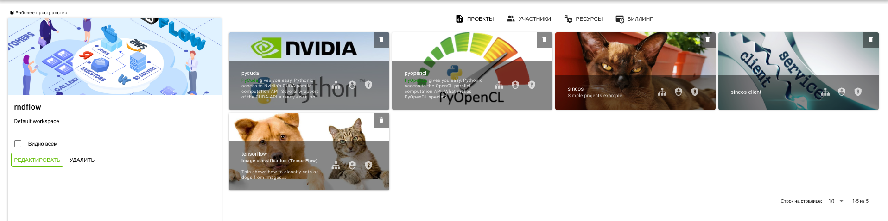
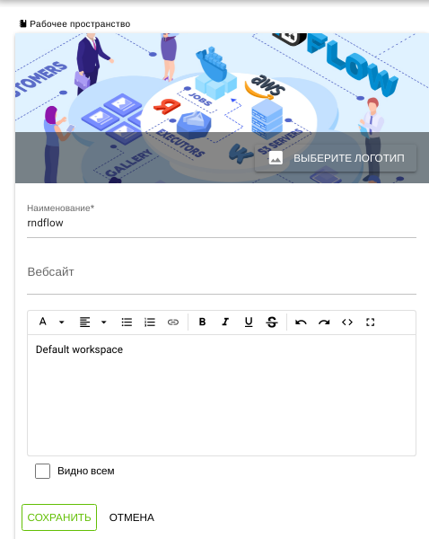
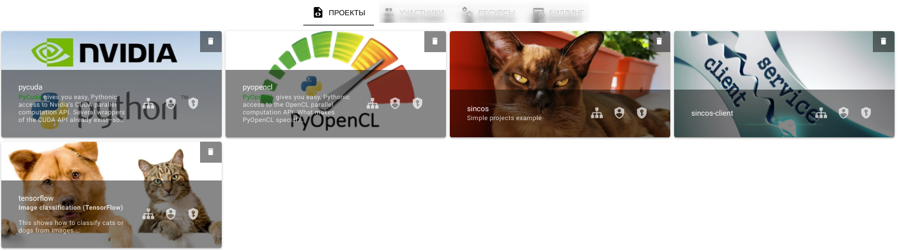
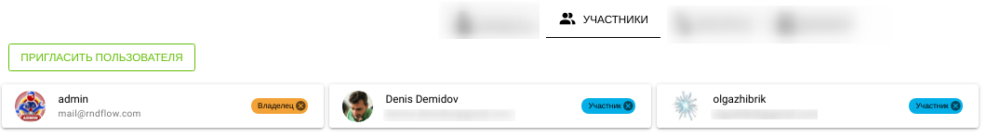
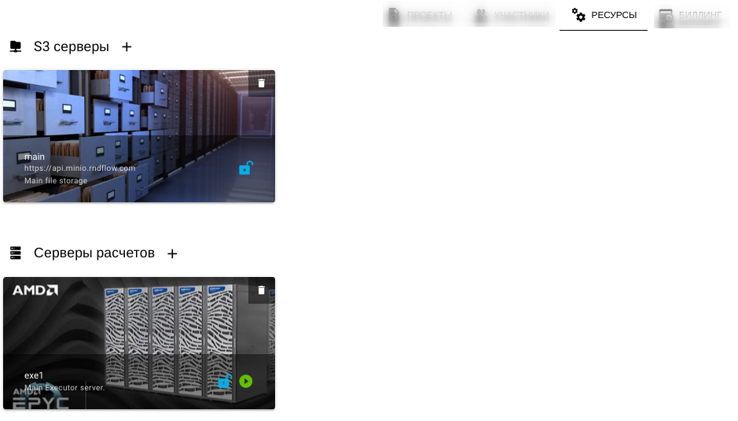

# Рабочее пространство

## Структура

Рабочее пространство доступно пользователю из [панели управления](dashboard).

Общий вид рабочего пространства:

Включает в себя:

- [Панель описания](#панель-описания)
-  Вкладка [Проекты](#проекты)
-  Вкладка [Участники](#участники)
-  Вкладка [Ресурсы](#ресурсы)
-  Вкладка [Биллинг](#биллинг)

## Панель описания

### Структура

Панель отображает:

- Изображение
- Название
-  Веб сайт
- Описание
- Переключатель разрешения публичного доступа (Видно всем)
- Кнопка "РЕДАКТИРОВАТЬ"
- Кнопка "УДАЛИТЬ"

### Редактирование

Нажатие кнопки **РЕДАКТИРОВАТЬ** переведет панель в режим редактирования:

## Проекты

Отображается список [плиток проектов](./dashboard.md#структура-плитки-проекта).

## Участники

### Типы участников

Перечень возможных участников рабочего пространства и их права:

- Владелец
  - Создание/удаление приглашения пользователя
  - Добавление/удаление S3 сервера
  - Добавление/удаление сервера расчетов
  - Обновление описания рабочего окружения
  - Удаление участника или другого владельца из рабочего окружения
  - Удаление рабочего окружения
  - Доступ к полному биллингу
  - Создание нового проекта
  - Удаление любого проекта
  - Просмотр списка проектов
  - Использование/редактирование любого проекта
- Участник
- Создание нового проекта
- Удаление проекта (при наличии прав владельца проекта)
- Использование/редактирование проекта (при наличии прав в проекте)
- Доступ к списку серверов расчета
- Доступ к списку S3 серверов
- Доступ к списку приглашений в проект
- Доступ к общей статистике биллинга проекта

### Структура панели

- Кнопка "ПРИГЛАСИТЬ ПОЛЬЗОВАТЕЛЯ" - для приглашения нового участника в рабочее окружение
- Список плиток пользователей
- Список **ПРИГЛАШЕННЫХ ПОЛЬЗОВАТЕЛЕЙ**

### Структура плитки участника

- Аватар
- Имя
- Электронный адрес
- Права доступа к рабочему пространству (Владелец/Участник)

## Ресурсы

Отображаются ресурсы

-  [S3 серверы](/docs/desc/s3.md)
-  [Серверы расчетов](/docs/desc/executor.md)

## Биллинг

Отображается:

- Информация о текущем [тарифе][1] c возможностью его изменения по нажатию кнопки **СМЕНИТЬ ТАРИФ**
- Отчет о расходах и доходах за выбранный период времени
  - Расходы - общие расходы
  - Доходы (роли) - доходы за использование платных [ролей][2].
  - Доходы (API ключи) -доходы за использование [API ключей][3].
  - График расходов и доходов

[1]: ./payplan.md
[2]: ./project_role.md
[3]: ./api_keys.md
