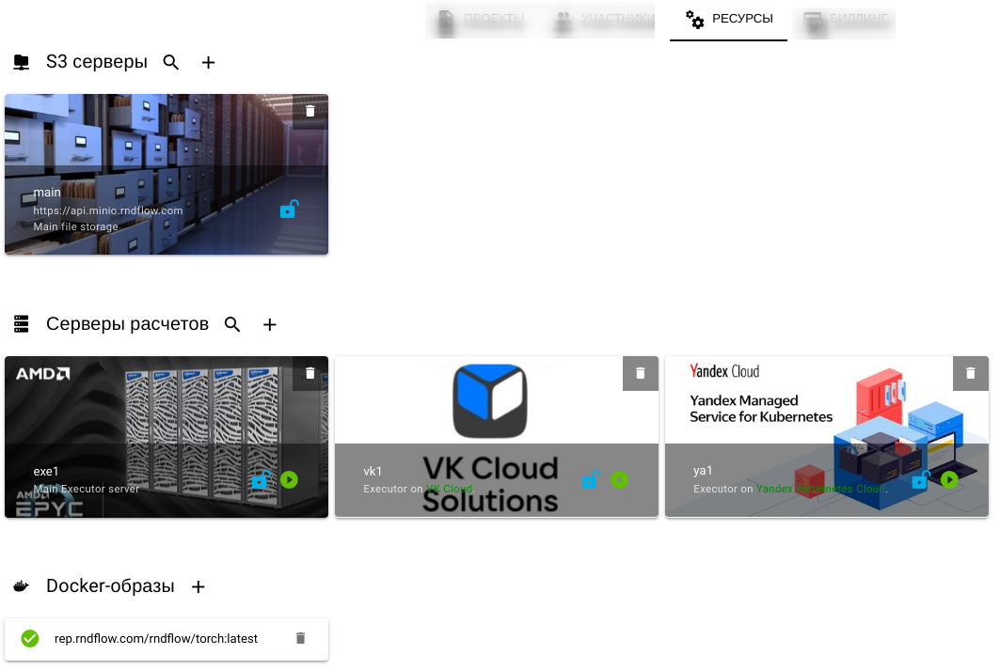
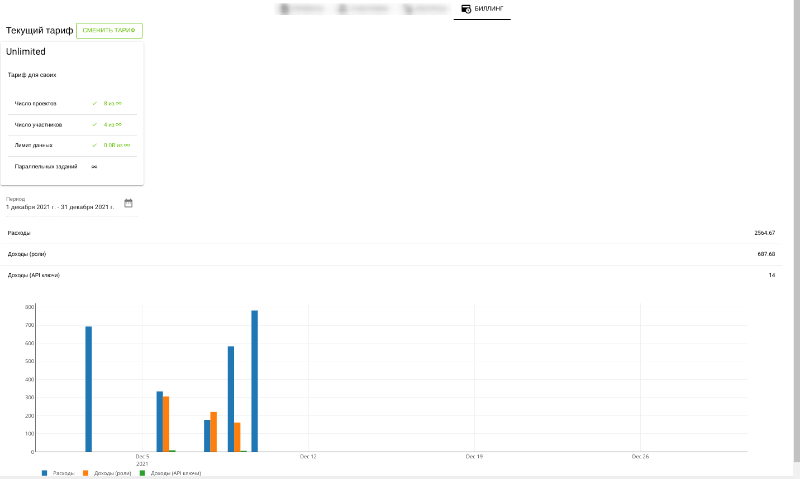

# Рабочее пространство

## Структура

Рабочее пространство доступно пользователю из [панели управления](dashboard).

Общий вид рабочего пространства:

Включает в себя:

- Панель описания
-  Вкладка [Проекты](#проекты)
-  Вкладка [Участники](#участники)
-  Вкладка [Ресурсы](#ресурсы)
-  Вкладка [Биллинг](#биллинг)

## Проекты

Отображается список [плиток проектов](dashboard.html#структура-плитки-проекта).

## Участники

Отображается:

- Кнопка "ПРИГЛАСИТЬ ПОЛЬЗОВАТЕЛЯ" - для приглашения нового пользователя в рабочее окружение
- Список плиток пользователей

Структура плитки пользователя:

- Аватар
- Имя
- Электронный адрес
- Права доступа к рабочему пространству (Владелец/Участник)

## Ресурсы

Отображаются ресурсы

-  S3 серверы
-  Серверы расчетов

## Биллинг

Отображается биллинг отчет.

## Панель описания

### Структура

Панель отображает:

- Изображение
- Название
-  Веб сайт
- Описание
- Переключатель разрешения публичного доступа (Видно всем)
- Кнопка "РЕДАКТИРОВАТЬ"
- Кнопка "УДАЛИТЬ"

### Редактирование

Нажатие кнопки **РЕДАКТИРОВАТЬ** переведет панель в режим редактирования:

