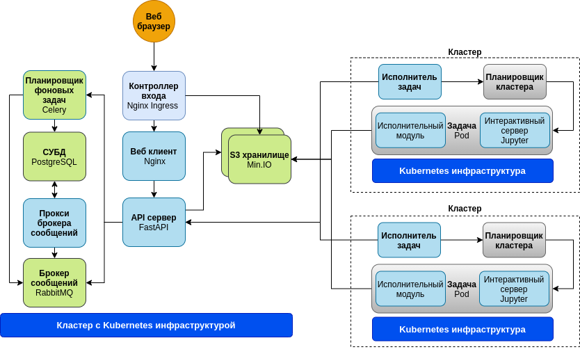

# Архитектура платформы

## Компоненты

В основе платформы лежит клиент-серверная архитектура, которая может быть условно представлена в виде трех программных уровней: сервер-облако, клиентский и вычислительный.

На схеме представлена архитектура платформы с двумя внешними вычислительными кластерами.

**Клиентский уровень** - веб приложение, обеспечивающие взаимодействие пользователей с сервисами платформы. Веб приложение разработано с использованием языка программирования [JavaScript](https://www.javascript.com/) и фреймворков [Quasar 2](https://quasar.dev/) и [Vue.js 3](https://v3.vuejs.org/) и развернут на веб сервере [NginX](https://nginx.org/en/).

Включает в себя:

- Веб клиент

**Сервер-облако** - программно-аппаратная инфраструктура, которая включает в себя комплекс прикладного и системного программного обеспечения, реализующая основные сервисы платформы и предоставляющая к ним удаленный доступ в интернет-среде. Сервер-облако является основным самодостаточными элементом платформы и может функционировать как изолированно в рамках отдельных организационных структур (компаний), так и совместно реализуя сложные распределенные последовательности обработки данных.

В него входят:

- Контроллер доступа - контроллер доступа из сети Интернет [Nginx Ingress Controller](https://kubernetes.github.io/ingress-nginx/)
- API сервер - REST сервер на основе [Fast API](https://fastapi.tiangolo.com/)
- Планировщик фоновых задач - менеджер запуска длительных фоновых задач на [Celery](https://docs.celeryproject.org/)
- Брокер сообщений - брокер обмена сообщениями между элементами платформы на [RabbitMQ](https://www.rabbitmq.com/) 3.8.9
- СУБД - база данных [PostgreSQL](https://www.postgresql.org/) 13
- Прокси брокера сообщений - прокси модуль обмена сообщениями между СУБД и брокером сообщений RabbitMQ
- S3 хранилище - объектное (файловое) хранилище данных [MinIO](https://min.io)

_API сервер_ - базовый компонент, реализующий основную бизнес логику функционирования платформы и обработки пользовательских запросов. Взаимодействие с сервером реализуется с помощью специального открытого API, которое может быть использовано как в программном обеспечении платформы так и в программных продуктах сторонних разработчиков.

_Брокер сообщений_ RabbitMQ создает единое пространство обмена сообщениями между серверными компонентами платформы и снижает нагрузку на системы реляционного хранения данных. Для оптимизации обмена сообщений платформа использует дополнительный прокси брокера сообщений (Message broker proxy).

_Сервер базы_ данных на основе PostgreSQL 13 используется для хранения служебной информации платформы, структуры и метаинформации графов обработки, а также непосредственного хранения пользовательских данных небольших объемов.
Обработчик фоновых задача на основе Celery используется для запуска длительных асинхронных служебных процедур.

_S3 хранилище_ используется для хранение различных объектных (файловых) данных. В качестве базового продукта используется программный продукт MinIO, который позволяет организовать различные архитектуры (в том числе распределенные) хранения данных, а также полностью совместим с стандартом доступа к данным S3 API. Кроме того платформа позволяет производить подключение внешних хранилищ, которые используют для доступа указанный тип API. Например, можно использовать внешнее облачное хранилище на основе [Yandex Object Storage](https://cloud.yandex.com/en/services/storage) или [VK Cloud Storage](https://mcs.mail.ru/storage/). Таким образом, можно подключать неограниченное количество объектных хранилищ как локальных так и внешних, и использовать их для хранения данных различных проектов. Если разные проекты используют один и тот же экземпляр объектного хранилища, то с целью изоляции они размещаются в различных бакетах, которые обеспечивают как логическое, так и физическое раздельное размещение данных.

**Вычислительный уровень (кластер)** - высокопроизводительная программно-аппаратная инфраструктура, предназначенная для непосредственного выполнения пользовательских исполнительных модулей (скрипты, программы) узлов.
Вычислительные кластера могут быть как интегрированными в сервер-облако так и кластерами общего пользования входящими в общедоступные вычислительные ресурсы.

В него входят:

- Исполнитель задач - планировщик запуска задач
- Задача - выполняемая задача в среде Kubernetes
- Интерактивный сервер - опциональный модуль интерактивного доступа к задаче на основе Jupyter сервера

_Исполнитель задач_ - специальный программный модуль, который отслеживает появления новых данных (пакетов для обработки) через API сервер и отправляет их на [выполнение](#TODO) в планировщик задач конкретного кластера.
В настоящий момент поддерживается исполнитель задач для организации запуска задач в среде [Kubernetes](https://kubernetes.io/). Исполнитель задач позволяет организовать проведение вычислений и на удаленных облачных вычислительных мощностях таких как [Yandex Managed Service for Kubernetes](https://cloud.yandex.com/en/services/managed-kubernetes) и [VK Cloud Containers](https://mcs.mail.ru/containers/). При этом исполнитель задач может располагаться как на стороне вычислительных ресурсов так и в произвольном месте.

По умолчанию задачи выполняются в неинтерактивном режиме. Также платформа предоставляет возможность запуска задачи в интерактивном режиме, при этом в контейнере пользователя дополнительно запускается [Jupyter](https://jupyter.org/) сервер, с которым пользователь может взаимодействовать обычным образом.

## Среда исполнения (контейнеры)

### Общее

Все компоненты платформы предназначены для запуска в [Docker](https://www.docker.com/) контейнере и рекомендуется осуществлять их запуск в среде [Kubernetes](https://kubernetes.io/).

Все задания запускаемые пользователем исполняются в Docker контейнерах, которые в свою очередь запускаются на подключенных к платформе Kubernetest кластерах.

Использование Docker контейнеров как среды исполнения позволяет осуществлять изоляцию выполняемых пользовательских вычислительных задач, а пользователю самостоятельно настраивать среду исполнения под требования своих прикладных задач.

Для каждого конкретного узла графа пользователь может указать необходимую среду исполнения (образ Docker контейнера) с указанием конкретного места (реестр/регистр) в сети Интернет, с которого платформа должна загрузить указанный образ. Например, можно использовать хранилище образов контейнеров [DockerHub](https://hub.docker.com/).

Доступ к образу должен осуществлять без дополнительной авторизации. После первого запуска образ будет закеширован на промежуточных прокси-регистрах платформы на уровне вычислительных кластеров, а также в локальных хранилищах образов Kubernetes на узлах.

Исполняемые контейнеры должны содержать в себя специальную библиотеку [job.py](https://github.com/rndflow/rndflow-job-py). Для этого образ должен быть создан из доступных базовых образов платформы или библиотека должна быть установлена самостоятельно (см. раздел [Docker образы. Управление и создание](#TODO)).

### OpenCL

Поддерживается счет только на специальных узлах кластера с использованием специализированных [контейнеров](#TODO).
При использовании необходимо указать количество требуемых карт в поле **ГПУ** в вкладке **Контейнер** панели узла соответствующего узла.

### CUDA

Поддерживается счет только на специальных узлах кластера с использованием специализированных [контейнеров](#TODO).
При использовании необходимо указать количество требуемых карт в поле **ГПУ** в вкладке **Контейнер** панели узла соответствующего узла.
