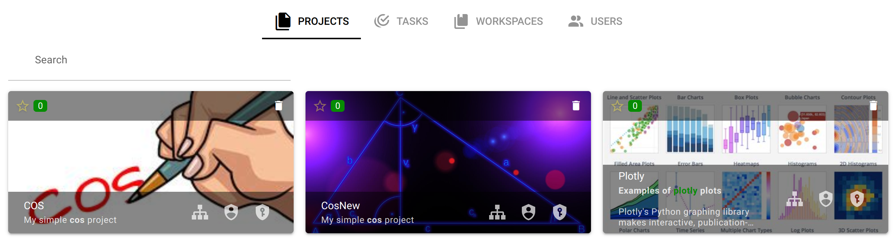

# Основные определения

[Рабочее пространство](/docs/desc/workspace.md) (Workspace) - изолированное рабочее окружение пользователя или группы пользователей со своим набором проектов, ресурсов, правами доступа.

[Проект](/docs/desc/project.md) (Project) - это конкретная реализация интеллектуального приложения или алгоритма средствами платформы.

[API ключ](/docs/desc/api_keys.md)- уникальный jWT идентификатор для программного доступа к проекту согласно разрешениям, которые определены в заданной ему при создании [роли](/docs/desc/project_role.md) проекта.

[Граф](/docs/desc/project.md#граф) (Graph) - интегрированная последовательность узлов и направленных связей между ними, в которой узлы соответствуют отдельным этапам или операциям реализуемого алгоритма, а направленные связи определяют направление передачи данных между ними (результаты выполнения одних узлов передаются в качестве входных данных другим узлам).

[Связь](/docs/desc/links.md) (Link) - соединение, обеспечивающее перемещение пакетов от узла источника к узлу назначения.

[Узел](/docs/desc/nodes.md) (Node) - отдельный блок графа, представляющий собой этап (операцию) реализуемого алгоритма.

[Группа](/docs/desc/nodes.md#группа) (Group) - совокупность узлов.

[Параметры узла](/docs/desc/node_params.md) (Parameters) - управляющие параметры выполнения узла, передаваемые исполнительной программе (скрипту) узла.

[Спецификация узла](/docs/desc/nodes.md#спецификация) - опциональное описание состава входных и выходных пакетов узла.

[Слой данных](/docs/desc/project.md#слои-данных) (Data layer) - это отдельное состояние графа проекта со своим независимым набором пакетов и параметрами узлов.

[Пакет](/docs/desc/package.md) (Package) - единый набор данных, поступающих на обработку на соответствующий узел.

[Мастер пакет](/docs/desc/package.md) (Master package) - выбранный пользователем корневой пакет слоя данных.

[Задание](/docs/desc/job.md) (Job) - экземпляр выполнение узла с конкретными входными пакетами и параметрами.

[Интерфейс](/docs/desc/interface.md) (Interface) - графический интерфейс управление проектом, предназначеный для предоставления пользователю возможности управления проектом без непосредственного взаимодействия с графом проекта.

[Сервер расчетов или исполнитель](/docs/desc/executor.md) (Executor) - cпециальный программный модуль платформы, который отвечает за запуск задач на определенном вычислительном кластере (сервере расчетов).

Отображение в панели управления проектом:

Информационная панель сервера расчетов:

[S3 сервер](/docs/desc/s3.md) (S3 Server) - объектное (файловое) хранилище для размещения данных (скрипты, файлы пакетов и т.п.).

Информационная панель S3 сервера:

[Среда исполнения. Контейнер](/docs/desc/nodes.md#контеинер) - Докер образ на основе которого будет создаваться контейнер для выполнения программных модулей узла в рамках конкретного задания.

