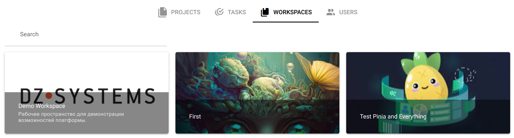

# Key Definitions

[Workspace](/desc/workspace.md) - an isolated working environment for a user or group of users with their own set of projects, resources, and access rights.

[Project](/desc/project.md) - a specific implementation of an intelligent application or algorithm using the platform's tools.
  

[API Key](/desc/api_keys.md) - a unique JWT identifier for programmatic access to a project according to the permissions defined in the [role](/desc/project_role.md) assigned to it during creation.

[Graph](/desc/project.md#graph) - an integrated sequence of nodes and directed links between them, where nodes correspond to individual stages or operations of the implemented algorithm, and directed links determine the direction of data transfer between them (the results of executing some nodes are passed as input data to other nodes).

[Link](/desc/links.md) - a connection that enables the movement of packages from the source node to the destination node.

[Node](/desc/nodes.md) - an individual block of the graph representing a stage (operation) of the implemented algorithm.

[Group](/desc/nodes.md#group) - a collection of nodes.

[Node Parameters](/desc/node_params.md) - control parameters for node execution, passed to the node's executable program (script).

[Node Specification](/desc/nodes.md#specification) - an optional description of the input and output package composition of a node.

[Data Layer](/desc/project.md#data-layers) - a separate state of a project's graph with its own independent set of packages and node parameters.

[Package](/desc/package.md) - a single set of data coming for processing to the corresponding node.

[Master Package](/desc/package.md) - the root package of the data layer selected by the user.

[Job](/desc/job.md) - an instance of node execution with specific input packages and parameters.

[Interface](/desc/interface.md) - a graphical interface for project management, designed to provide the user with the ability to manage the project without directly interacting with the project graph.

[Computation Server or Executor](/desc/executor.md) - a special software module of the platform responsible for running tasks on a specific computing cluster (computation server). Displayed in the project management panel:

Computation server information panel:

[S3 Server](/desc/s3.md) - an object (file) storage for storing data (scripts, package files, etc.). S3 server information panel:

[Runtime Environment. Container](/desc/nodes.md#container) - A Docker image on which a container will be created to run the node's software modules within a specific job.
